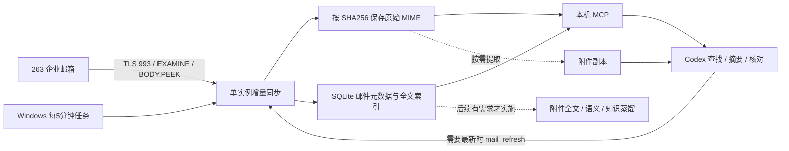

# 如何实现，以及为什么这样部署

## 1. 会计场景的默认选择

| 方案 | 查询速度与及时性 | 运维负担 | 建议 |
|---|---|---|---|
| 每次直连全量搜索 | 每次经历登录、网络读取；中文和历史正文检索会反复传输 | 部署最少，日常查询效率较低 | 仅用于在线未读状态、诊断或临时小范围查找 |
| 本地索引 + 增量同步 | 普通查询不联网；最新请求先刷新，后台可每 5 分钟同步 | 初次需缓存，占用本地磁盘；后续轻量 | **本项目默认方案** |
| 本地索引 + 语义检索 + 蒸馏 | 可回答跨线程、长期关系和流程问题 | 模型、来源治理、纠错、更新成本增加 | 暂不为会计日常查信默认部署 |

本地快查和知识蒸馏是两回事。不蒸馏，也能保存原件、查询正文、核对附件，足以支持常见会计工作。这里不承诺固定毫秒延迟：速度取决于邮件量、磁盘和关键词长度；本地查询避免了逐封网络传输，是可验证的收益。

## 2. 原邮件知识库实际怎么工作

原系统面向长期贸易案件：263 → 单向邮件镜像 → MIME 和附件解析 → SQLite 精确检索 → 可选语义向量 → 人物、公司、项目、时间线和工作流知识 → 只读 MCP → Codex。

原 `mcp_server.py` 查询本地索引，本身不连 263 或触发同步；同步由另一条维护流程运行。原 `imap_readonly.py` 和 `sync.py` 要求只读选择、`BODY.PEEK`、UIDVALIDITY 定位，防止读取导致已读或错误定位。原 `distill.py` 把模型推断和原始证据关联，高影响内容保留为待核候选。

Windows 版本沿用来源和只读原则，重新实现最小部署，不是把私有原项目整体拷过来：

| 原环境部件 | Windows 版处理 |
|---|---|
| macOS Keychain 与 `/usr/bin/security` | 显式 Windows Credential Manager；不读密码环境变量 |
| Homebrew mbsync / notmuch | Python 标准库 IMAP + SQLite，减少安装门槛 |
| Maildir 文件名中的 `:2,` | SHA-256 `.eml` 文件名，兼容 Windows |
| macOS 的 fcntl 文件锁 | Windows 使用 msvcrt 字节锁，非 Windows 测试用 flock |
| LaunchAgent / 原作者后台任务 | 当前 Windows 用户计划任务，固定任务名可停用 |
| MLX / Metal 向量模型 | 默认不安装 |
| 原业务知识/规则/个人路径 | 不复制，由她的任务和本机事实决定 |

## 3. 本仓库代码分工

| 模块 | 作用 |
|---|---|
| `config.py` | 非秘密设置，当前账号/主机绑定的凭据服务名，Windows 原生凭据存取 |
| `reader.py` | TLS、中文 IMAP 目录编码、只读会话、UID、MIME、直连诊断、附件提取 |
| `cache.py` | 账号隔离、不可变原件、SQLite、FTS5 trigram、覆盖和失败状态 |
| `sync.py` | 单实例锁、目录 UID 清单比对、按批增量传输、本地读接口 |
| `server.py` | MCP 的 7 个明确工具，没有任意 IMAP 命令入口 |
| `__main__.py` | 安装配置、诊断、同步、查找和 MCP 启动命令 |
| `scripts/` | Windows 安装与当前用户计划任务 |

### 同步算法

1. 取得跨进程锁，再创建一条 TLS 会话复用到本轮各目录。
2. 通过 EXAMINE 取得 UIDVALIDITY。发生变化时，旧 generation 立即退出当前结果，但原件不删除。
3. 对配置起始日期执行 UID SEARCH，取得**完整范围清单**。清单失败不能判断远端删信。
4. 完整清单与本地 UID 比较，下载缺少的 UID；不只用最大 UID 水位，避免回填/中断漏信。尚未缓存的较新邮件优先。
5. 取大小和 INTERNALDATE，再用 BODY.PEEK 获取原始 MIME。超限、失败和未处理分别记录，不冒称完成。
6. 原件以哈希写入后，事务提交元数据、正文和附件清单。索引可以重建，原件用于核对。
7. 完整覆盖且无缺口才推进该目录成功时间。失败保留旧成功时间，同时记录失败尝试。

每轮读取 UID 清单是元数据通信，不重新下载全部邮件。大邮箱的清单本身也有成本，先限制所需账期和目录，未来确有性能瓶颈再实现更复杂的 UID 增量与周期全量核对。

### 本地检索和原件定位

SQLite 支持 FTS5 trigram 时，对三个及以上字符的查询使用全文候选索引，再做文字匹配；短词（例如“发票”）走本地匹配回退，保证中文短词可用。SQLite 缺少该分词器时会明确报告 `literal_scan_fallback`。索引包含标题、正文、收发件人、Message-ID 和附件名；不包含附件内部文本。

邮件键为 `账号命名空间 + folder + UIDVALIDITY + UID`，Message-ID 仅作辅助。原件 SHA-256 用于完整性校验，不把不同目录下相同 Message-ID 简单合并成一个状态。凭据主机或账号改变时命名空间随之变化。

日期筛选使用 INTERNALDATE 的原始日历日；排序使用统一 UTC 时间，发件人信头日期保留给核对。业务账期最终仍要检查原件日期。只读本地读取不会替用户改变 263 上的未读标记；当前未读状态需在线查询，不依赖旧缓存。

远端移动/删除后，成功清单核对会隐藏范围内消失的旧位置，但保留其原件。对范围外邮件不作“已删除”推断。减少同步范围、移除目录不会自动清理历史缓存；查询保留各目录的覆盖与成功时间，不保证它们仍是服务器当前状态。

### MCP 接口

| 工具 | 网络 | 本地写入 | 用途 |
|---|---|---|---|
| `system_status` | 无 | 首次可初始化索引结构 | 看配置、索引方式、各目录覆盖/新鲜度 |
| `mail_search` | 无 | 同上 | 默认本地查询，offset 分页 |
| `mail_get_message` | 无 | 损坏原件可标记待重取 | 核对缓存原件哈希、读取正文和附件表 |
| `mail_download_attachment` | 无 | 写附件副本 | 从已缓存原件提取附件，不执行 |
| `mail_refresh` | 263 IMAPS | 写原件/索引/状态 | 按配置增量同步 |
| `mail_list_folders` | 263 IMAPS | 无 | 配置时获取真实目录名 |
| `mail_live_search` | 263 IMAPS | 无 | 当前未读、诊断；有扫描上限、不填充本地索引 |

本机数据目录结构：`config.json`、`cache/index.sqlite3`、`cache/objects/<sha>.eml`、`downloads/<sha>.<ext>`、`refresh.lock` 和计划任务状态文件。不存在 SMTP、自动记账或付款链路。

## 4. 有意保留的边界

首轮 MIME 同步**会传输附件内容**，即使尚未提取附件。这是在部署简单、财务原件可核对和带宽之间的选择。默认不做全量附件解析/OCR，也不偷偷调用外部 AI API。大型附件和不支持的附件类型有明确缺口，不能通过文件名或 OCR 猜金额。

5 分钟轮询不是秒级推送。单封网络操作有超时，批次时间预算是软边界；一个进行中的操作可能超过批次预算。计划任务还设总运行时限，停止后原件与索引提交保持可重试，下一轮继续。
